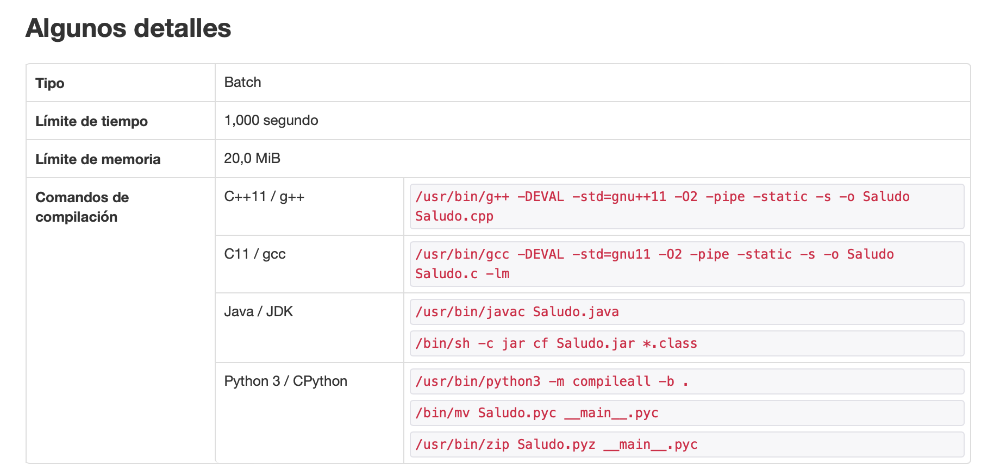
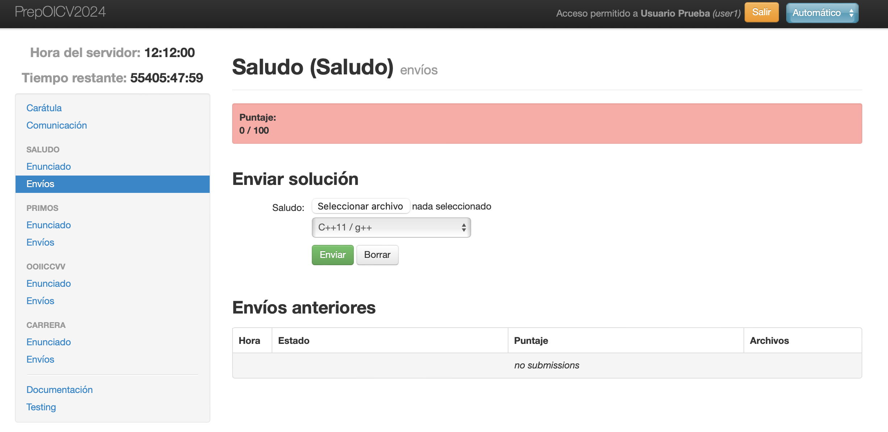
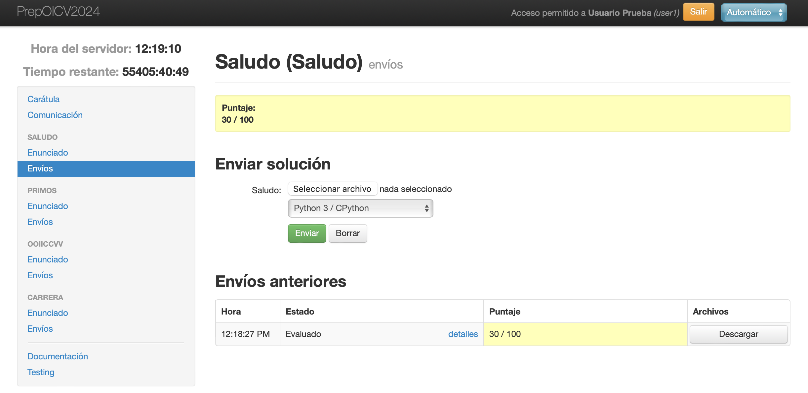
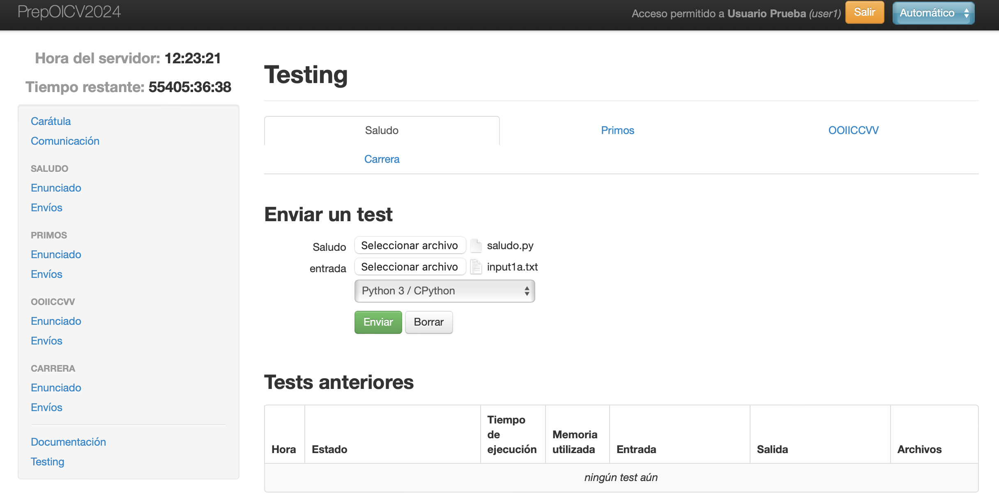
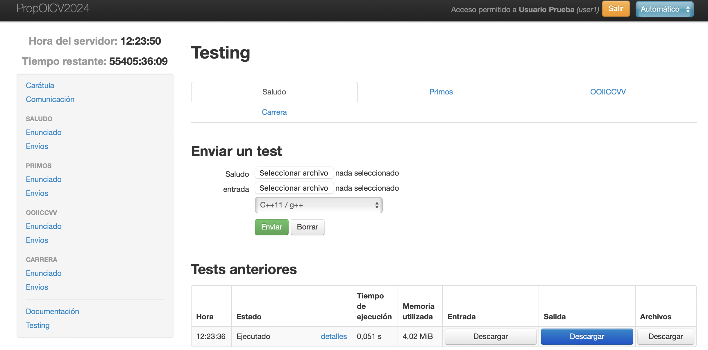

# OICV - Olimpíada Informàtica Comunitat Valenciana #

## Ejercicios a resolver en la OICV ##

En la OICV tendrás que resolver ejercicios de programación en uno
de los lenguajes del concurso (C, C++, Python 3 o Java). En todos los
ejercicios deberás leer unos datos de la entrada estándar, resolver el
problema indicado e imprimir la solución siguiendo el formato
establecido. 

En general, a no ser que especifique lo contrario, no debes buscar que
el algoritmo para resolver el problema sea óptimo; solo que los
resultados sean los correctos. Tampoco tendrás que tratar con errores
en la entrada, ya que todos los casos de prueba serán correctos.

Los ejercicios tendrán diferentes apartados, cada uno con una
puntuación determinada. La suma de todos los apartados de cada
ejercicio será de 100 puntos.

La puntuación final de un participante será la suma de todos los
apartados resueltos correctamente. El ganador del concurso será el
que mayor puntuación obtenga. En caso de empate, será el primero en
terminar los ejercicios.

Puedes ver un ejemplo del formato de los ejercicios en [este enlace](./saludo.pdf).

## Software disponible en el concurso ##

En los ordenadores en los que se celebrará el concurso se dispondrá
del siguiente software.

- Sistema operativo Linux
- Editor Visual Studio Code
- Editor gedit
- Compiladores:
  - C11 / gcc
  - C++11 / g++
  - Python 3
  - Java / JDk 1.8

## Evaluador del concurso ##

En el concurso se utilizará un servidor de evaluación que comprobará
la corrección de los programas y proporcionará las puntuaciones de
cada ejercicio.

Podrás probar el evaluador en los siguientes enlaces en los que estará
disponible un concurso de prueba:

- [Evaluador de la sede de Alicante](https://oicv.eps.ua.es/)
- [Evaluador de la sede de Valencia](https://etseoicv.uv.es)


### Login ###

Recibirás un correo electrónico en el que se informará de tu
usuario y contraseña para entrar en el concurso de prueba.

Pantalla de login:


### Ejercicios ###

Una vez en el concurso de prueba verás una pantalla inicial con un
resumen de los distintos ejercicios. En el menú izquierdo encontrarás
enlaces al enunciado y a la página de envío de tu programa para cada
ejercicio. También verás enlaces a la página principal, a una página
donde poder enviar preguntas a los organizadores, unos enlaces con
una breve documentación y una página de prueba, en la que podrás subir
tus programas y comprobar su salida.


En el servidor de pruebas hay 4 problemas de ejemplo:

- Saludo
- Primos
- OOIICCVV
- Carrera

Los tres primeros son problemas de prueba muy sencillos para que puedas
comprobar el funcionamiento del juez de evaluación. El último problema es más
complicado, y ya tiene un nivel similar a los problemas que se presentan en la
olimpiada.

Pinchando en el enunciado del problema entrarás en la siguiente pantalla en la
que podrás descargar el enunciado en forma de fichero PDF. Los problemas
tendrán varios apartados con una puntuación cada uno de ellos.


Bajo el enunciado aparece unos detalles sobre el tiempo y la memoria
máxima permitida en la ejecución del programa, así como los comandos
que se lanzarán en el servidor para compilar los programas.



### Envío de tu programa ###

Pinchando en la opción `Envíos` del enunciado accedes a la página para
subir el fichero con el código fuente que resuelve el ejercicio. En
este caso se muestra cómo se sube el fichero `saludo.py`.



### Puntuación ###

Una vez subido, el programa se compila y se ejecuta sobre unos
ficheros de tests. La puntuación resultante se muestra en la
pantalla. 

Puedes pinchar en la opción `detalles` para ver los detalles de la puntuación.



En este caso el ejercicio tiene dos apartados. El primero valorado en
30 puntos y el segundo en 70. Para conseguir la puntuación del
apartado debes realizar correctamente todos los tests del apartado. En
este caso se falla en el segundo test del segundo apartado, por lo que
no se obtienen los 70 puntos. Sí que se obtienen los 30 puntos del
primer apartado.


Puedes enviar todas las versiones que desees del programa. Tu
puntuación en el ejercicio será la máxima de todas las versiones que envíes.


### Testing ###

Puedes comprobar el resultado que se obtiene de la ejecución de tu
programa en el servidor con la opción `Testing` en el menú de la
izquierda.

Cuando accedes a esa opción puedes subir tu programa y un fichero de entrada.



Una vez subidos ambos ficheros, el programa se compila y se ejecuta en
el servidor. Puedes comprobar el resultado descargándolo con el botón `Descargar`.



### Solución ###

Para que te sea sencillo comenzar con un ejemplo que funciona correctamente, a
continuación listamos un programa Python que soluciona correctamente el problema
`Saludo`.

Fichero **saludo.py**:

```python
# Leer n (cantidad de saludos) y k (indicador de si leer o no nombres)
n, k = map(int, input().split())

# Si k es 0, imprimir 'Hola OICV' n veces
if k == 0:
    for _ in range(n):
        print("Hola OICV")

# Si k es 1, leer nombres y saludar con cada nombre
else:
    for _ in range(n):
        nombre = input().strip()  # Leer el nombre
        print(f"Hola {nombre}")

```
