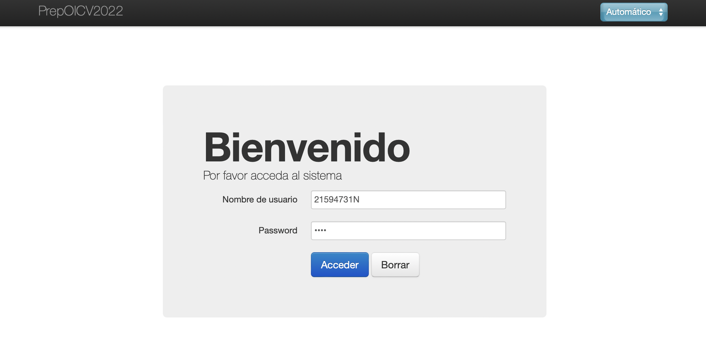
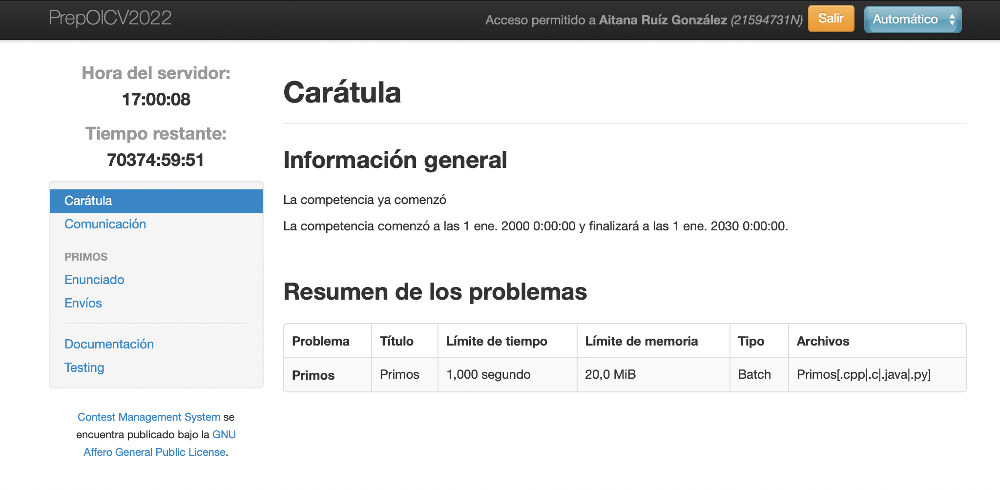
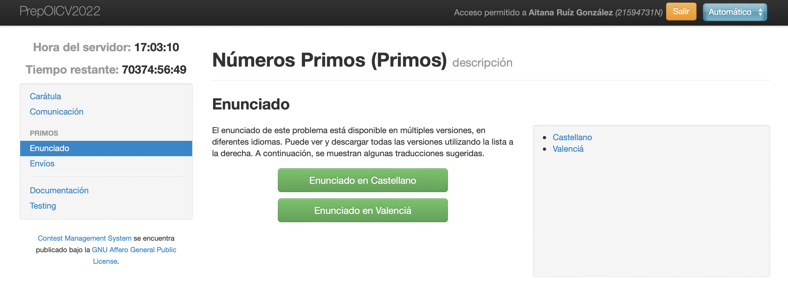
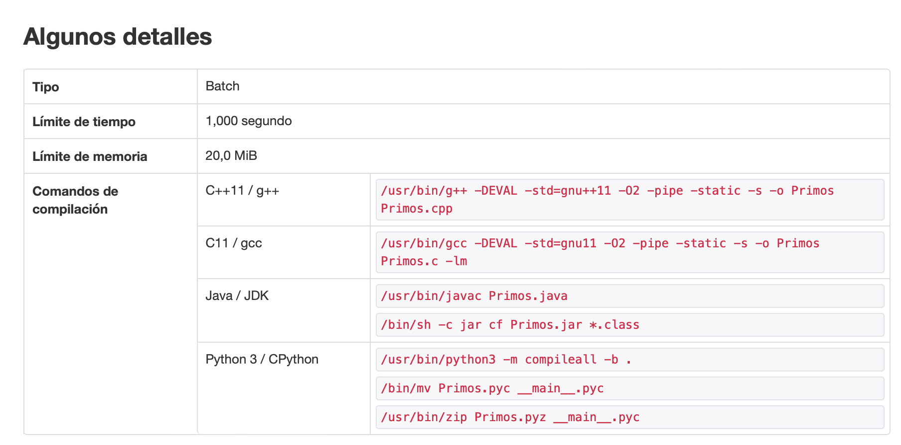
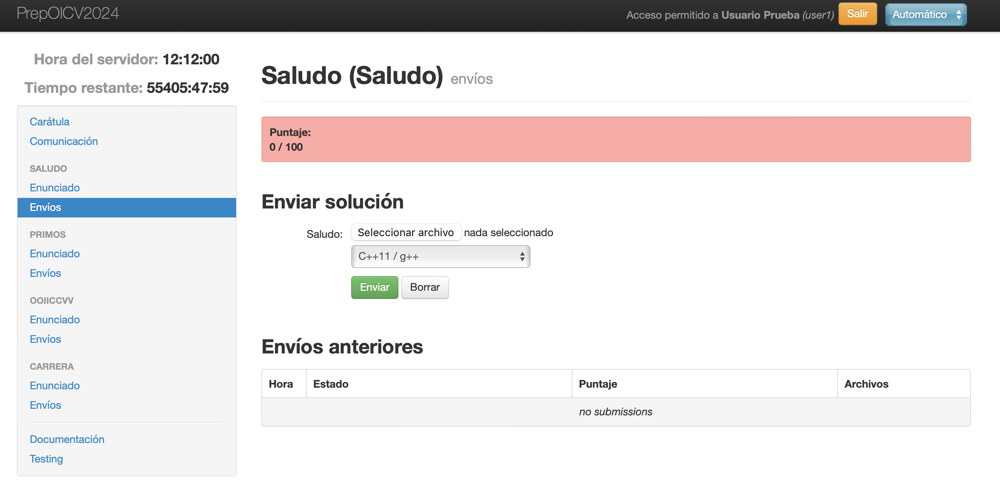
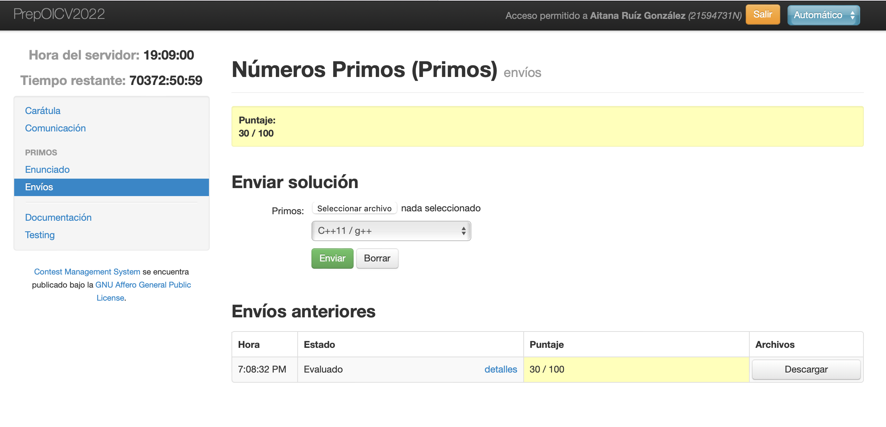
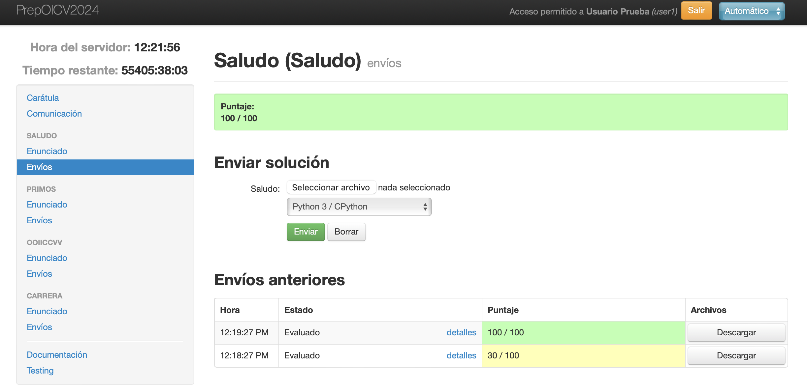
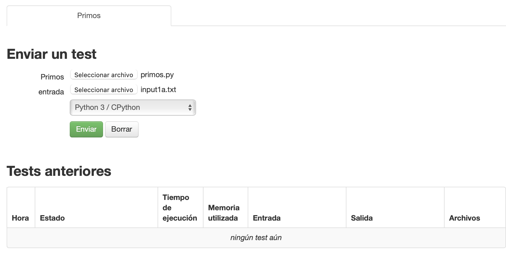
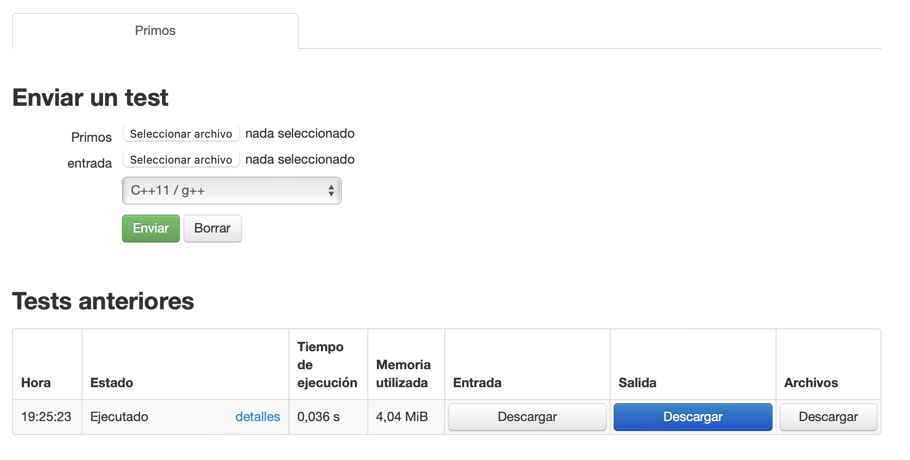

## Software disponible en el concurso ##

En los ordenadores en los que se celebrará el concurso se dispondrá
del siguiente software.

- Sistema operativo Linux
- Editor Visual Studio Code
- Editor gedit
- Compiladores:
  - C11 / gcc
  - C++11 / g++
  - Python 3
  - Java / JDk 1.8

## Uso evaluador OICV2022 ##

